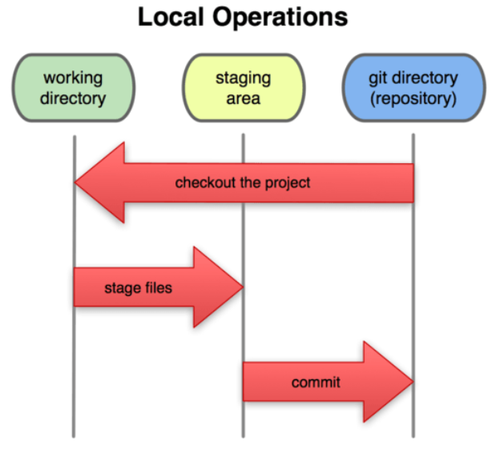
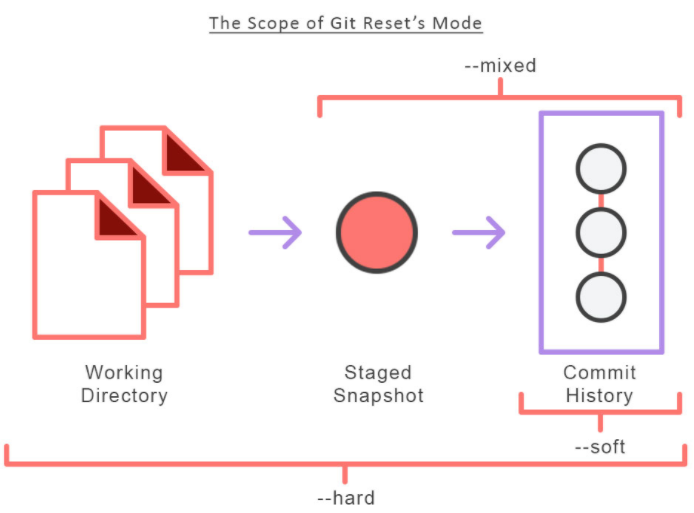
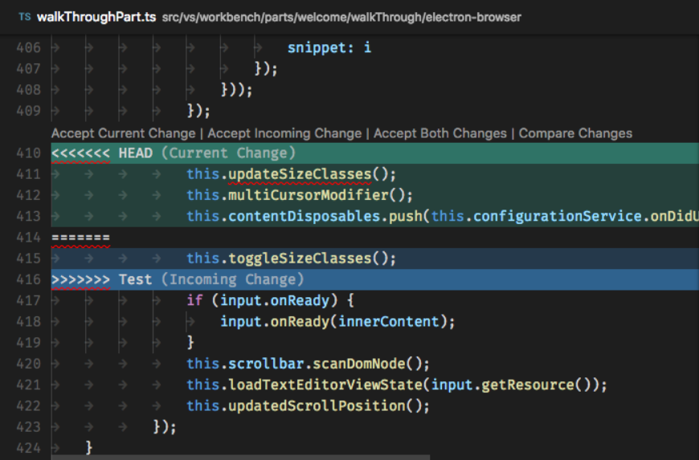

# Git y GitHub

# Introducción a Git

## ¿Qué es un sistema de control de versiones?

El SCV o VCS (por sus siglas en inglés) es un **sistema que registra los cambios realizados sobre un archivo o conjunto de archivos a lo largo del tiempo** , de modo que puedas llevar el historial del ciclo de vida de un proyecto, comparar cambios a lo largo del tiempo, ver quién los realizó o revertir el proyecto entero a un estado anterior. Cualquier tipo de archivo que se encuentre en un ordenador puede ponerse bajo control de versiones.

## ¿Qué es Git?

Git es un SCV distribuido, diseñado por Linus Torvalds, pensando en la eficiencia y la confiabilidad del mantenimiento de versiones de aplicaciones cuando éstas tienen un gran número de archivos de código fuente. Git está optimizado para guardar todos estos cambios de forma atómica e incremental.

Se obtiene su mayor eficiencia con archivos de texto plano, ya que con archivos binarios no puede guardar solo los cambios, sino que debe volver a grabar el archivo completo ante cada modificación, por mínima que sea, lo que hace que incremente demasiado el tamaño del repositorio.

| **&quot;Guardar archivos binarios** en el repositorio de git **es una mala práctica** , solo debería guardarse archivos (como logos) que no sufran casi modificaciones durante la vida del proyecto. Los binarios deben guardarse en un CDN (Content Delivery Network)**&quot;** |
| --- |

## ¿Qué es Github?

Es una plataforma de desarrollo colaborativo (forja) para alojar proyectos de manera remota utilizando el sistema de control de versiones Git. Se utiliza principalmente para la creación de código fuente de programas de computadora.

Github puede considerarse como una red social de código para programadores y en muchos casos es visto como tu currículum vitae o portafolio.

# Comandos y Conceptos Básicos de Git

## Las tres secciones principales de un proyecto de Git

- El directorio de Git (Git Directory, Repository)
- El directorio de trabajo (Working Directory)
- El área de preparación (Staging Area)

## Staging Area y Git Directory

Al ejecutar el comando &quot;git init&quot; (comando para iniciar un repositorio git) ocurren dos cosas:

- Se crea una carpeta .git. El cual es el repositorio local donde Git almacena los metadatos y la base de datos de objetos para el proyecto. Es la parte más importante de Git, y **es lo que se copia cuando clonas** un repositorio desde otro ordenador.
- Se crea un archivo sencillo que define el staging area, generalmente está contenido en el directorio de Git, que almacena información acerca de lo que va a ir en tu próxima confirmación (commit).

## Ciclo básico de trabajo en Git

- Se modifica una serie de archivos en el directorio de trabajo.
- Se preparan los archivos añadiéndolos al área de preparación o staging. &#39;git add&#39;
- Se confirman los cambios: las instantáneas de los archivos que están en el área de staging se almacenan de forma permanente en el directorio de Git. &#39;git commit&#39;



## Estados de un archivo

**Commited:** Si una versión concreta de un archivo está en el directorio de Git, se considera confirmada.

**Staged:** Si ha sufrido cambios desde que se obtuvo del repositorio, pero ha sido añadida al área de preparación, está preparada.

**Modified:** Y si ha sufrido cambios desde que se obtuvo del repositorio, pero no se ha preparado, está modificada.

## ¿Qué es un Branch y cómo funciona un Merge en Git?

Todos los commits se aplican sobre una rama. Por convención se empieza a trabajar en la rama master (puede cambiarse el nombre de ser necesario) y se crean nuevas a partir de esta, para crear flujos de trabajo independientes. Esto es muy util para mantener el flujo de trabajo entre los distintos actores del repositorio permitiendo por ejemplo mantener la rama master lo más limpia de errores mientras se ejecutan pruebas o añadidos al software.

Crear una nueva rama implica copiar un commit (de cualquier rama), pasarlo a otro lado (a otra rama) y continuar el trabajo de una parte específica de nuestro proyecto sin afectar el flujo de trabajo principal (que continúa en la rama master).

| ⚠️ **Estándar o buena práctica:**
- Todo lo que esté en la rama _&quot;master&quot;_ va a producción.

- Las nuevas features y experimentos se realizan en una rama _&quot;development&quot;_ que se unen a master cuando estén listas.
- Los issues o errores se solucionan en una rama _&quot;hotfix&quot;_ para unirse a master tan pronto como sea posible. Esta rama también se suele llamar Bug Fixing.


Se pueden crear todas las ramas y commits que se requieran para mantener ordenado el proyecto. Incluso puede aprovechar el registro de cambios de Git para crear ramas, traer versiones viejas del código, arreglarlas y combinarlas de nuevo para mejorar el proyecto.

Se debe tener en cuenta al combinar ramas los conflictos que puedan generarse, al decir conflictos nos referimos a que al unir dos versiones del proyecto exite la posibilidad (muy posible) de que dos archivos que queramos unir tengan cosas que difieren entre sí y que no son reparables automaticamente por git ya que no sabe cual de los cambios es el correcto. Git siempre intentará unir los cambios automáticamente, pero no siempre funciona bien, eventualmente cuando esto ocurra, se deben resolver los conflictos a mano.

## Comandos básicos

### Configuración inicial de git

- git config --global user.email \&lt;tu@email.com\&gt;: configura un email.
- git config --global user.name \&lt;Nombre como se verá en los commits\&gt;: configura un nombre.
- git config --list: lista las configuraciones.

### Crear repositorios y commits

- git init: inicializa un repositorio de GIT en la carpeta donde se ejecute el comando.
- git add: añade los archivos especificados al área de preparación (staging).
- git commit -m &quot;commit description&quot;: confirma los archivos que se encuentran en el área de preparación y los agrega al repositorio.
- git commit -am &quot;commit description&quot;: añade al staging area y hace un commit mediante un solo comando. (No funciona con archivos nuevos)
- git status: ofrece una descripción del estado de los archivos (untracked, ready to commit, nothing to commit).
- git rm (. -r, filename) (--cached): remueve los archivos del index.
- git clone https://github.com/matifrancois/Git-Github.git : Clonar un repositorio remoto en tu computadora local.

### Analizar cambios en los archivos de un proyecto Git

- git log: lista de manera descendente los commits realizados.
- git log --stat: además de listar los commits, muestra la cantidad de bytes añadidos y eliminados en cada uno de los archivos modificados.
- git log --all --graph --decorate --oneline: muestra de manera comprimida toda la historia del repositorio de manera gráfica y embellecida.
- git show filename: permite ver la historia de los cambios en un archivo.
- git diff &lt;commit1&gt; &lt;commit2&gt;: compara diferencias entre en cambios confirmados.

### Volver en el tiempo con branches y checkout

- git reset &lt;commit&gt; --soft/hard: regresa al commit especificado, eliminando todos los cambios que se hicieron después de ese commit.
- git checkout &lt;commit/branch&gt; &lt;filename&gt;: permite regresar al estado en el cual se realizó un commit o branch especificado, pero no elimina lo que está en el staging area.
- git checkout -- &lt;filePath&gt;: deshacer cambios en un archivo en estado modified (que ni fue agregado a staging)

### Git rm y git reset

#### git rm

Este comando nos ayuda a eliminar archivos de Git sin eliminar su historial del sistema de versiones. Esto quiere decir que si necesitamos recuperar el archivo solo debemos &quot;viajar en el tiempo&quot; y recuperar el último commit antes de borrar el archivo en cuestión.

git rm no puede usarse así nomás. Se debe usar uno de los flags para indicar a Git cómo eliminar los archivos que ya no se necesitan en la última versión del proyecto:

- git rm --cached &lt;archivo/s&gt;: Elimina los archivos del área de Staging y del próximo commit pero los mantiene en nuestro disco duro.
- git rm --force &lt;archivo/s&gt;: Elimina los archivos de Git y del disco duro. Git siempre guarda todo, por lo que podemos acceder al registro de la existencia de los archivos, de modo que podremos recuperarlos si es necesario (pero debemos usar comandos más avanzados).

#### git reset

**Con git reset volvemos al pasado sin la posibilidad de volver al futuro**. Borramos la historia y la debemos sobreescribir.

- git reset --soft: Vuelve el branch al estado del commit especificado, manteniendo los archivos en el directorio de trabajo y lo que haya en staging considerando todo como nuevos cambios. Así podemos aplicar las últimas actualizaciones a un nuevo commit.
- git reset --hard: Borra absolutamente todo. Toda la información de los commits y del área de staging se borra del historial.



- git reset HEAD: No borra los archivos ni sus modificaciones, sólo los saca del área de staging, de forma que los últimos cambios de estos archivos no se envíen al último commit. Si se cambia de opinión se los puede incluir nuevamente con git add.

### Ramas o Branches

Al crear una nueva rama se copia el último commit en esta nueva rama. Todos los cambios hechos en esta rama no se reflejarán en la rama master hasta que hagamos un merge.

- git branch &lt;new branch&gt;: crea una nueva rama.
- git checkout &lt;branch name&gt;: se mueve a la rama especificada.
- git checkout -b &lt;branch name&gt;: Crea una rama y se mueve a ella, (vendría a ser como una fusion de los 2 anteriores en un solo comando).
- git merge &lt;branch name&gt;: fusiona la rama actual (en la que estas parado) con la rama especificada y crea un nuevo commit de esta fusión.
- git branch: lista las ramas creadas.


## ¿Cómo resolver conflictos en Git?

Al trabajar en dos o más ramas sobre las mismas líneas de código, ocurrirán conflictos a la hora de hacer merge. Git automáticamente intenta solucionar estos conflictos pero de no poder hacerlo nos especificará en nuestro código dónde se encuentran los conflictos.

Cuando se encuentra en la estapa de merge, que vendría a ser como el purgatorio de los commits es decir la etapa previa a ser subidos al repositorio remoto con git push (el equivalente al cielo o la nube 😉), se han de resolver los conflictos que git no pudo resolver por su cuenta.

Para resolver este problema existen las soluciones que comentaremos a continuación aunque todas se basan al final en el mismo principio.

<br>

### Resolucion a mano

<br>

Abrir los archivos que presentan diferencias con un editor de texto como notas de windows y buscar donde tenga lineas como las siguientes:
```
    <<<<<<HEAD
        ...
        ...
        ...
    =========
        ***
        ***
    >>>>>Nombre_de_la_rama
```

Es decir el código de ambas ramas aparece mostrado, al principio el código que se encuentra en la rama HEAD (representado en este caso con puntitos) y luego separado por una fila de iguales aparece el código de la rama a mergear, que se encuentra representado con asteríscos.

De esta manera se ha de dejar sólo lo que nos interesa, es decir si quisieramos quedarnos con el cambio hecho en la rama deberiamos quitar tanto la linea <<<< HEAD  como la linea >>>>>Nombre_de_la_rama, las correspondientes lineas con puntitos y la fila de iguales es decir quedaría algo así.

```
    ***
    ***
```

Debo hacer esto con todos los cambios que me figuren que se han de resolver. 
Una vez hecho estos cambios se ha de guardar los archivos modificados y luego hacer añadirlos al stage y commitearlos (y subirlos al repositorio remoto) para terminar de resolver el merge 

<br>

### Resolución utilizando Visual Studio Code

<br>

Una forma un poco más fácil de resolver estos conflictos, aunque en el fondo es similar, es utilizar Visual Studio Code. Este IDE nos simplifica un poquito la vida con su manejo de control de versiones, el mismo se puede utilizar a su vez para resolver conflictos generados en el merge.

De esta manera al hacer uso de VS Code para resolver estos conflictos, los mismos aparecen pintados lo que facilita ver donde se encuentran, a su vez en la columna izquierda se muestran todos los archivos con conflictos, y los modificados listos para ser commiteados. 

Dentro de cada archivo en la etapa que se ha de modificar aparecen diferentes opciones seleccionables las mismas son &quot;Accept Current Change&quot; que permite aceptar lo que se encuentra en el HEAD (es decir donde fusionemos las ramas (usualmente master)) y &quot;Accept Incomming Change&quot; que acepta el cambio que se encuentre en la rama a fusionar.

En la siguiente imagen se puede ver mejor lo explicado



Una vez resueltos los confictos en todos los archivos se han de guardar los archivos modificados y commitear los mismos, este proceso se puede realizar desde consola o con ayuda del control de versiones dentro de Visual Studio Code.

A continuacion se muestra un gif que muestra como se pueden comparar los cambios y resolverlos de esta manera.


## Trabajar con un repositorio remoto

- git clone https://github.com/matifrancois/Git-Github.git : Clonar un repositorio remoto en tu computadora local.
- git remote add origin &lt;link&gt;: enlaza el repositorio local con el repositorio remoto.
- git push origin &lt;branchName&gt;: exportar los archivos confirmados en el repositorio local al repositorio remoto.
- git pull origin &lt;branchName&gt;: importa los archivos del repositorio remoto al repositorio local y al working directory.
- git fetch: importa los archivos remotos al repositorio local pero no al working directory.
- git merge: una vez hecho el git fetch, hace falta hacer un git merge para que los archivos importados aparezcan en el working directory.

# GitHub - Repositorios remotos

Por seguridad y practicidad, para trabajar con repositorios remotos lo ideal es no enviar las credenciales de loging cada vez que se transfiera información con la plataforma, para eso se configuran las llaves SSH, siendo el método más seguro.

## Llaves SSH

1. Generar las llaves SSH. Si bien no es obligatorio, se recomienda proteger la llave privada con una contraseña cuando lo solicita el proceso de generación.
ssh-keygen -t rsa -b 4096 -C &lt;[tu@email.com](mailto:tu@email.com)&gt;
**-t** rsa es el algoritmo elegido de cifrado (acrónimo de Rivest-Shamir-Adleman creadores del algoritmo)
**-b** 4096 son los bits que tendrá la llave. 2048 suele ser suficiente pero con 4096 se extrema la seguridad.
**-C** &lt;comentario a elección&gt;
2. Terminar de configurar según sistema operativo.
  1. En Windows y Linux:
 # Encender el &quot;servidor&quot; de llaves SSH local:
eval $(ssh-agent -s)
 # Añadir la llave privada SSH a este &quot;servidor&quot;:
ssh-add &lt;ruta-a-la-llave-privada&gt;
  2. En Mac:
 # Encender el &quot;servidor&quot; de llaves SSH local:
eval &quot;$(ssh-agent -s)&quot;
 # Para versiones de OSX superior a Mac Sierra (v10.12)
 # se debe crear o modificar un archivo &quot;config&quot; en la carpeta
 # del usuario con el siguiente contenido (respetar las mayúsculas):
Host \*
 AddKeysToAgent yes
 UseKeychain yes
 IdentityFile
 ruta-a-la-llave-privada
# Añadir la llave privada SSH al &quot;servidor&quot; de llaves SSH local
 # (en caso de error se puede ejecutar este mismo comando
 # pero sin el argumento -K):
ssh-add -K &lt;ruta-a-la-llave-privada&gt;

## Conexión a GitHub con SSH

Luego de crear las llaves SSH se debe entregar la llave pública a GitHub para realizar la comunicación de forma segura y sin necesidad de escribir el usuario y contraseña.

Para esto entrar a la Configuración de Llaves SSH en GitHub, crear una nueva llave con el nombre deseado y el contenido de la llave **pública** de tu computadora.

Luego actualizar en nuestra pc la URL del repositorio remoto, cambiando la URL con HTTPS por la URL con SSH:

git remote set-url origin \&lt;url-ssh-del-repositorio-en-github\&gt;

## Tags y versiones en Git y GitHub

Los tags o etiquetas permiten asignar versiones a los commits con cambios más importantes o significativos del proyecto.

En GitHub esto crea releases, versiones descargables del proyecto en ese preciso estado.

Comandos para trabajar con etiquetas:

- Crear un nuevo tag y asignarlo a un commit:
git tag -a \&lt;nombre-del-tag\&gt; -m \&lt;mensaje del commit\&gt; \&lt;id-del-commit-al-que-asignar-la-etiqueta\&gt;
- Borrar un tag en el repositorio local:
git tag -d nombre-del-tag
- Listar los tags de nuestro repositorio local:
git tag
 Listar los tags indicando a qué commit se asignó cada uno
 git show-ref --tags
- Publicar un tag en el repositorio remoto:
git push origin --tags
- Borrar un tag del repositorio remoto:
git tag -d nombre-del-tag
 git push origin :refs/tags/nombre-del-tag

## Manejo de ramas en GitHub

Puedes trabajar con ramas que nunca envias a GitHub, así como pueden haber ramas importantes en GitHub que nunca usas en el repositorio local.

- Crear una rama en el repositorio local:

-git branch nombre-de-la-rama o

-git checkout -b nombre-de-la-rama
- Publicar una rama local al repositorio remoto:
git push origin nombre-de-la-rama

Se puede ver gráficamente el entorno y flujo de trabajo local con Git usando el comando gitk.

# Flujo de trabajo profesional con Pull requests

En un entorno profesional normalmente se bloquea la rama master, se desarrolla en para enviar código a dicha rama pasa por un code review y luego de su aprobación se unen códigos.

Para realizar pruebas enviamos el código a un &quot;staging server&quot; (servidor de prueba), una vez pasadas las pruebas tanto del código como de la aplicación, se pasan al servidor de producción mediante un pull request (GitHub y Bitbucket) o merge request (GitLab).

## Eliminar una rama

- Eliminar una rama local
git branch -d localBranchName
- Eliminar una rama remota
git push origin --delete remoteBranchName

## Readme.md es una excelente práctica

README.md es una excelente práctica en los proyectos, md significa Markdown, es una especie de código que permite cambiar la manera en que se ve un archivo de texto.

Funciona en muchas páginas, por ejemplo la edición en Wikipedia es un lenguaje intermedio que no es HTML, no es texto plano, es una manera de crear textos formateados.

Datos a tener en cuenta para escribir un buen README.md

1. **Nombre:** Especificamos cómo se llama nuestro proyecto.
2. **Descripción:** es donde diremos para qué exactamente es el proyecto, qué problemas resuelve y cualquier información relevante.
3. **Instalación:** muestra los pasos específicos para instalar el proyecto. Por lo general se muestra un pedazo del código necesario para la instalación.
4. **Cómo usar:** describe rápidamente casos de uso en los cuales se puede usar el proyecto, además de mostrar funcionalidades.
5. **Cómo contribuir:** si es un proyecto open source se describe acá la forma en la que deberían crearse las contribuciones.
6. **Licencia:** muestra la licencia que tiene el proyecto.

# Sitio web público con GitHub Pages

GitHub tiene un servicio de hosting gratis llamado GitHub Pages, se puede tener un repositorio donde el contenido del repositorio se vaya a GitHub y se vea online.

# Múltiples entornos de trabajo

## Rebase: Reorganizando el trabajo realizado

Con rebase se puede recoger todos los cambios confirmados en una rama y ponerlos sobre otra.


1. Cambiar a la rama que queremos traer los cambios
git checkout experiment
2. Aplicar rebase para traer los cambios de la rama que queremos
git rebase master

| **&quot;rebase es una mala práctica** no debería usarse a menos que no quede otra opción. **&quot;** |
| --- |

## Stash: Guardar cambios en memoria y recuperarlos después

Sirve para cuando se necesita recordar el estado actual del directorio de trabajo y del índice, pero se requiere volver y limpiar el directorio de trabajo.


- git stash
 guarda las modificaciones locales en memoria y revierte el directorio de trabajo para coincidir con el estado del commit de HEAD.
 Es típico cuando se hacen cambios que no merecen una rama o no merecen un rebase, sino que simplemente se está probando algo y luego se quiere volver rápidamente a la versión anterior, que es la correcta.

- git stash branch \&lt;nombre-nueva-rama\&gt;
Crea un nuevo branch con las modificaciones guardadas en memoria con stash.

## Clean: Limpiar el proyecto de archivos no deseados

A veces se crean archivos durante la realización de un proyecto, que realmente no forman parte del directorio de trabajo y no se debería agregar.

- Para saber qué archivos se borrará
git clean --dry-run
- Para borrar todos los archivos listados (que no son carpetas)
git clean -f

## Cherry-pick: Traer commits viejos al head de un branch

Cherry-pick trae las modificaciones realizadas en un commit específico de otra rama.

git cherry-pick \&lt;IDCommit\&gt;

Un caso de uso válido sería el siguiente:

Se encuentra un problema en la rama de producción, ésta tiene modificaciones hechas que no están en la rama de desarrollo (commit G), se desarrolla un fix de urgencia (commit H).


Si se requiere incorporar el fix a la rama de desarrollo pero **sin las modificaciones del commit G** , se realiza un cherry-pick del commit H a desarrollo (commit H&#39;).


| **&quot;Cherry-pick suele ser una mala práctica** porque significa que estamos reconstruyendo la historia. Debe usarse como último recurso. **&quot;** |
| --- |

## Amend reconstruir commits

Amend (remendar - reconstruir) agrega cambios al último commit, tanto de archivos como del mensaje.

- git add \&lt;archivos a agregar\&gt;
 git commit --amend

## Buscar en archivos y commits de Git con Grep y log

A medida que nuestro proyecto se hace grande vamos a querer buscar ciertas cosas.

- git grep color
 busca en todo el proyecto los archivos en donde está la palabra color.
- git grep -n color
 indicará en qué línea está la palabra color.
- git grep -c color
 indicará cuántas veces se repite la palabra color y en qué archivo.
- git grep -c &quot;\&lt;p\&gt;&quot;
 indicará cuántas veces se utiliza el atributo \&lt;p\&gt; de HTML

## Reset y Reflog: &quot;Úsese en caso de emergencia&quot; 🧯

¿Qué pasa cuando todo se rompe y no sabemos qué está pasando?

- Volver al estado en que el proyecto funcionaba
git reset \&lt;HashDelHEAD\&gt;
- Mostrar todos los cambios del HEAD.
git reflog
- Mantener lo que haya en staging
git reset --soft \&lt;HashDelHEAD\&gt;
- Resetear absolutamente todo incluyendo lo que haya en staging
git reset --hard \&lt;HashDelHEAD\&gt;

| 🚨 **&quot;reset es una mala práctica**. Debe ser el último recurso. **&quot;** |
| --- |